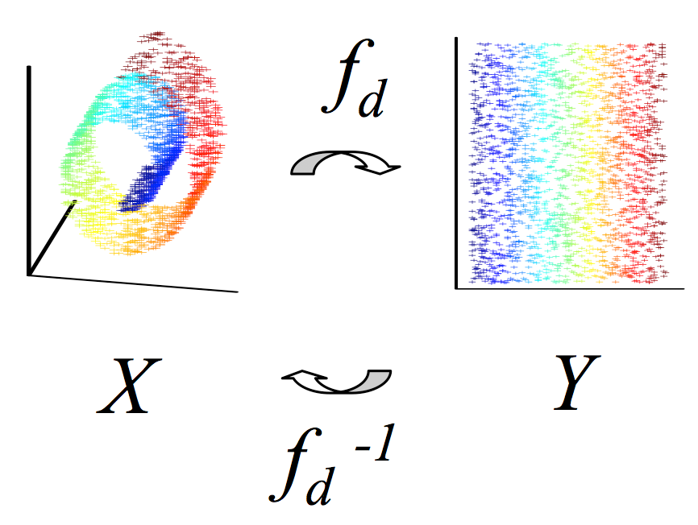

<h1>Dimensionality Reduction</h1>

<h2>What's the problem?</h2>

The problem is the <b>Curse of dimensionality</b>:
<i>The curse of dimensionality refers to various phenomena that arise when analyzing and organizing data in high-dimensional spaces (often with hundreds or thousands of dimensions) that do not occur in low-dimensional settings such as the three-dimensional physical space of everyday experience.</i>

Indeed, as you have seen till now, a lot of machine learning problems involve thousands or millions of features and this make training very slow and also the result not too accurate.

<h2>What we do then?</h2>

We reduce these dimensions! It's like when you compress your files to save space. Of course with this operation we lose some information, but in theory those information are "useless" for our goal.

<h2>Techniques:</h2>
<ul>
    <li>PCA (projection)</li>
    <li>Kernel PCA</li>
    <li>LLE (different approach --> manifold learning)</li>
    <li>MDS</li>
    <li>t-SNE (very good when you want to <b>visualize</b> your data)</li>
    <li>...</li>
</ul>

In this jupyter notebook I explore PCA and t-SNE using MNIST dataset.
